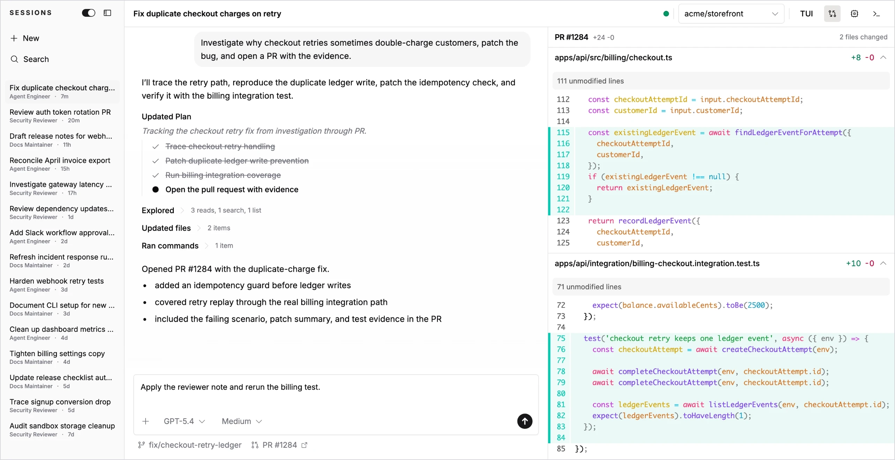

# About Mistle

Mistle is an open-source platform for running and automating background coding agents in sandboxes.

Run agents in secure sandboxes with brokered credentials, reusable snapshots, connected tools, and sessions your team can inspect and steer.



## Features

- **Integrations** connect external systems and models such as GitHub, Slack, and OpenAI.
- **Credential brokering** lets agents use external services without secrets living in sandboxes.
- **Identity attribution** links users to external accounts so work can be attributed to the right person.
- **Sandbox profiles** define the tools, permissions, and environment an agent starts with.
- **Snapshots** capture prepared sandbox environments so sessions can start quickly with the required tools, dependencies, and configuration already in place.
- **Sessions** start interactive agent work such as debugging, code review, and repository changes.
- **Triggers** respond to external events, such as webhook deliveries from connected systems.

## Run Mistle locally

You can spin up Mistle easily, assuming you have Docker installed:

```bash
curl -fsSL https://raw.githubusercontent.com/mistlehq/mistle/main/deploy/compose/local/install.sh | sh
```

The script:

- Runs [deploy/compose/local/install.sh](deploy/compose/local/install.sh).
- Installs the local Docker Compose files into `~/.mistle/local`.
- Creates `~/.mistle/local/.env` from `.env.example` if it does not exist.
- Preserves an existing `~/.mistle/local/.env`.
- Starts Mistle by running `~/.mistle/local/up.sh`.

Once this succeeds, you can open the dashboard at [http://localhost:3000](http://localhost:3000). Note that for email OTP auth, you'll need to use the locally running Mailpit at [http://localhost:8025](http://localhost:8025) to retrieve the OTP.

This runs Mistle locally using Docker containers as sandboxes. Mistle also supports remote sandbox providers such as [E2B](https://e2b.dev).

If you want to wind down the stack, run:

```bash
~/.mistle/local/down.sh
```

If you want to remove the installation:

```bash
# Remove the docker compose related files and scripts
rm -rf ~/.mistle/local/down.sh
```

Remember to delete the necessary Docker volumes, as well as images that were pulled.

## Other notes

- Mistle is still early, so do expect bugs.
- The Mistle CLI is early and not yet ready for general usage. Refer to [docs/cli.md](./docs/cli.md) for current CLI notes.
- We are currently not accepting contributions yet. Please open an issue for bug reports, feature requests, and discussion.
- Bug reports, feature requests, etc. are still welcome though! Please feel free to open an issue.

## Architecture

Refer to [docs/architecture.md](./docs/architecture.md).

## Roadmap

Refer to [docs/roadmap.md](./docs/roadmap.md).

## Local development

If you want to run the dev stack locally, refer to [CONTRIBUTING.md](CONTRIBUTING.md).
