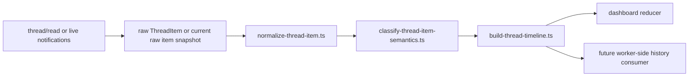

# Codex Semantic Classification Implementation

This document defines the implementation for Codex semantic classification in Mistle.

## Problem

Mistle currently has three separate layers touching Codex conversation data:

- `packages/codex-app-server-client` handles raw JSON-RPC operations and notifications.
- `apps/dashboard` hydrates and reduces raw Codex turns and notifications into chat state.
- `apps/control-plane-worker` uses a provider adapter for workflow orchestration and only reads coarse thread state.

The semantic action layer needed for labels such as `Exploring`, `Searching the web`, `Making edits`, and `Running commands` does not exist yet.

Right now the dashboard reducer already performs some item normalization, but it discards the most important input for Codex-style semantic grouping: `commandExecution.commandActions`.

## Locked Decisions

The following decisions are part of this spec and are no longer open questions.

- `plan` stays outside the semantic action grouping layer.
- `plan` remains a first-class dashboard chat entry and is not downgraded to `generic-item` as part of this work.
- the semantic layer owns semantic identity, grouping, aggregate counts, and canonical display keys
- the dashboard owns localized strings, final chat-entry view-model shaping, and rendering
- dashboard state becomes item-first for Codex turns: normalized items are the source of truth, and grouped chat output is derived from those items
- hydrated history and live item snapshots use the same normalize -> classify -> group pipeline, with delta accumulation remaining in the dashboard reducer
- grouped semantic blocks ship in the same implementation as the state-model rewrite; this is a one-shot migration, not a staged rollout

These choices follow the reference implementations:

- `opencode` groups only specific adjacent context tools and keeps status labels in UI/i18n, but Mistle’s semantic grouping layer generalizes adjacency grouping across semantic kinds rather than stopping at exploring-only
- `codex` keeps grouped execution state as a derived model over underlying call state and renders plan updates as separate history cells rather than folding them into exploring/editing groups

## Implementation Boundary

Place the semantic classification layer in `packages/codex-app-server-client`, above raw transport and below application-specific UI state.

## Reference Implementations

Use these codebases as the implementation references for the semantic model and grouped presentation behavior.

### `opencode`

`opencode` uses a UI-first, typed-tool approach. It groups adjacent tool parts that belong to a context-tool set and then renders them as a higher-level `Exploring` or `Explored` block.

Key files:

- `/Users/jonathanlow/Projects/opencode/packages/ui/src/components/message-part.tsx`
  - `groupParts()` groups adjacent context tools into one synthetic context block at lines `395-437`
  - `isContextGroupTool()`, `contextToolTrigger()`, and `contextToolSummary()` define the grouped-tool classification and aggregate counts at lines `559-630`
  - `ContextToolGroup()` renders the grouped `Exploring` or `Explored` block and count summary at lines `765-835`
- `/Users/jonathanlow/Projects/opencode/packages/ui/src/components/tool-status-title.tsx`
  - active vs completed label transitions at lines `23-120`
- `/Users/jonathanlow/Projects/opencode/packages/ui/src/i18n/en.ts`
  - status strings such as `Exploring`, `Explored`, `Searching the web`, `Making edits`, and `Running commands` at lines `50-58`

### `codex`

`codex` uses a parser-first approach. It parses shell commands into semantic actions, decides whether a cell is an exploring cell from those parsed actions, then renders a grouped TUI presentation from that semantic state.

Key files:

- `/Users/jonathanlow/Projects/codex/codex-rs/shell-command/src/parse_command.rs`
  - `parse_command()` turns raw command tokens into `ParsedCommand` values and collapses unknown parses to a single unknown command at lines `25-48`
- `/Users/jonathanlow/Projects/codex/codex-rs/tui/src/exec_cell/model.rs`
  - `ExecCell` holds grouped command calls and decides whether the cell is exploratory at lines `1-166`
  - `is_exploring_cell()` and `is_exploring_call()` are the key classification checks at lines `119-165`
- `/Users/jonathanlow/Projects/codex/codex-rs/tui/src/exec_cell/render.rs`
  - `exploring_display_lines()` renders grouped `Exploring` or `Explored` chat output at lines `252-354`
- `/Users/jonathanlow/Projects/codex/codex-rs/tui/src/history_cell.rs`
  - `web_search_header()` renders `Searching the web` or `Searched` at lines `1513-1518`

## Boundary Rationale

`packages/codex-app-server-client` already owns:

- `thread/read`
- `turn` lifecycle operations
- notification transport
- the reusable Codex session surface consumed by the dashboard

That package is the narrowest shared boundary that:

- knows the Codex protocol
- is still independent from any one UI
- can preserve `ThreadItem` structure before downstream reducers flatten it

The worker provider adapter remains focused on execution orchestration. The dashboard remains a consumer of shared semantic output, not the owner of Codex protocol interpretation.

## Implementation Structure

Split the package into three layers.

### 1. Raw transport

Responsibilities:

- request/response transport
- notification transport
- operation wrappers like `readCodexThread()`

Files that stay transport-only:

- `packages/codex-app-server-client/src/json-rpc/client.ts`
- `packages/codex-app-server-client/src/session/types.ts`
- `packages/codex-app-server-client/src/codex/operations.ts`

### 2. Normalized thread-item mapping

Map raw `ThreadItem` values into normalized internal shapes without throwing away structured Codex fields.

This layer preserves the equivalent of the semantic input that `codex` gets from `ParsedCommand` and that `opencode` gets from typed tool parts. In practical terms, it preserves `commandExecution.commandActions` rather than flattening command executions into plain strings.

Files:

- `packages/codex-app-server-client/src/thread-items/types.ts`
- `packages/codex-app-server-client/src/thread-items/normalize-thread-item.ts`

This layer preserves:

- command executions with `commandActions`
- file changes with their change list
- web search items
- reasoning summary and reasoning content
- dynamic, MCP, and collab tool calls

### 3. Semantic classification and grouping

Classify normalized items and group them for chat presentation.

Files:

- `packages/codex-app-server-client/src/thread-items/classify-thread-item-semantics.ts`
- `packages/codex-app-server-client/src/thread-items/build-thread-timeline.ts`

This layer:

- classify each normalized item into a semantic kind
- optionally group adjacent items into higher-level blocks suitable for UI
- remain deterministic and side-effect free

This split mirrors both reference implementations:

- `codex` separates semantic classification in `exec_cell/model.rs` from grouped rendering in `exec_cell/render.rs`
- `opencode` separates context-tool grouping and summary calculation from the final `ContextToolGroup` rendering

## Implementation Flow

Follow this call order:

1. Read raw Codex thread data from `packages/codex-app-server-client/src/codex/operations.ts`.
2. Convert raw `ThreadItem` values into `NormalizedCodexThreadItem` values.
3. Classify each normalized item into a semantic kind.
4. Group adjacent classified items within each turn into `SemanticActionGroup` values when they are groupable by semantic kind.
5. Return the grouped timeline to app-level consumers such as `apps/dashboard`.

Use the same pipeline for live notifications:

1. receive raw item notification
2. if the notification is a delta-only event, update the dashboard's in-flight raw item snapshot for that `itemId`
3. once a current raw item snapshot exists, normalize that snapshot
4. update the existing normalized item for that `itemId`, or append a new normalized item if none exists
5. reclassify the affected item
6. regroup the affected turn

Hydrated history and live item snapshots use the same semantic model. Do not create a separate live-only grouping path inside the semantic layer.

Delta transport handling is not part of the semantic layer. It remains the responsibility of the dashboard reducer to accumulate partial item state until a current raw item snapshot exists.

Normalization, classification, and grouping are separate stages. Do not infer semantic groups while reading raw protocol data.



## Module Responsibilities

These are the file-level ownership rules for the implementation.

### `packages/codex-app-server-client/src/codex/operations.ts`

- owns raw RPC calls only
- returns raw thread payloads
- does not normalize items
- does not classify semantics
- does not build grouped timelines

### `packages/codex-app-server-client/src/thread-items/types.ts`

- defines the normalized item model
- defines normalized command action shapes
- defines semantic classification result types
- defines grouped timeline types

### `packages/codex-app-server-client/src/thread-items/normalize-thread-item.ts`

- maps raw `ThreadItem` values into `NormalizedCodexThreadItem`
- preserves protocol fields needed by later stages
- maps raw item lifecycle states into shared semantic-layer status values
- does not decide whether something is `exploring`, `making-edits`, or `running-commands`
- does not group adjacent items

### `packages/codex-app-server-client/src/thread-items/classify-thread-item-semantics.ts`

- accepts one normalized item
- returns one semantic kind plus display metadata needed by grouping
- uses `commandActions` for command-execution classification
- does not merge adjacent items

### `packages/codex-app-server-client/src/thread-items/build-thread-timeline.ts`

- groups already-classified items
- enforces grouping boundaries
- computes aggregate counts
- preserves child items in group order
- exposes both per-turn and whole-thread timeline builders

### `apps/dashboard/src/features/codex-client/codex-chat-state.ts`

- stops performing Codex-specific semantic interpretation
- consumes shared normalized or grouped results from `@mistle/codex-app-server-client`
- does not discard `commandActions`

## File Layout

```text
packages/codex-app-server-client/
  src/
    codex/
      operations.ts
    json-rpc/
      client.ts
    session/
      types.ts
    thread-items/
      index.ts
      types.ts
      normalize-thread-item.ts
      classify-thread-item-semantics.ts
      build-thread-timeline.ts
```

## Data Model

The current Codex protocol already includes the raw structures this semantic layer needs, especially `commandExecution.commandActions`.

### Normalized item

This shared shape preserves the protocol semantics.

```ts
export type NormalizedCodexThreadItem =
  | {
      kind: "user-message";
      id: string;
      turnId: string;
      text: string;
    }
  | {
      kind: "assistant-message";
      id: string;
      turnId: string;
      text: string;
      phase: string | null;
      status: "streaming" | "completed";
    }
  | {
      kind: "plan";
      id: string;
      turnId: string;
      text: string;
      status: "streaming" | "completed";
    }
  | {
      kind: "reasoning";
      id: string;
      turnId: string;
      source: "summary" | "content";
      text: string;
      status: "streaming" | "completed";
    }
  | {
      kind: "command-execution";
      id: string;
      turnId: string;
      command: string | null;
      cwd: string | null;
      commandStatus: string | null;
      exitCode: number | null;
      output: string | null;
      durationMs: number | null;
      commandActions: readonly NormalizedCommandAction[];
      reason: string | null;
      status: "streaming" | "completed";
    }
  | {
      kind: "file-change";
      id: string;
      turnId: string;
      fileChangeStatus: string | null;
      changes: readonly NormalizedFileChange[];
      output: string | null;
      status: "streaming" | "completed";
    }
  | {
      kind: "tool-call";
      id: string;
      turnId: string;
      toolType: "dynamic" | "mcp" | "collab";
      title: string;
      body: string | null;
      detailsJson: string | null;
      status: "streaming" | "completed";
    }
  | {
      kind: "web-search";
      id: string;
      turnId: string;
      query: string | null;
      detailsJson: string | null;
      status: "streaming" | "completed";
    }
  | {
      kind: "generic-item";
      id: string;
      turnId: string;
      itemType: string;
      title: string;
      body: string | null;
      detailsJson: string | null;
      status: "streaming" | "completed";
    };
```

### Normalized command action

This shape is the semantic basis for Codex-style grouping.

```ts
export type NormalizedCommandAction =
  | { type: "read"; command: string; name: string; path: string | null }
  | { type: "list-files"; command: string; path: string | null }
  | { type: "search"; command: string; query: string | null; path: string | null }
  | { type: "unknown"; command: string };
```

### Semantic classification result

```ts
export type SemanticActionKind =
  | "exploring"
  | "running-commands"
  | "making-edits"
  | "thinking"
  | "searching-web"
  | "tool-call"
  | "generic";

export type SemanticActionGroup = {
  id: string;
  kind: SemanticActionKind;
  status: "streaming" | "completed";
  displayKeys: {
    active: SemanticDisplayKey | null;
    completed: SemanticDisplayKey | null;
  };
  counts: {
    reads: number;
    searches: number;
    lists: number;
  } | null;
  items: readonly NormalizedCodexThreadItem[];
};

export type StandaloneTimelineEntry = {
  id: string;
  item: NormalizedCodexThreadItem;
  semanticKind: SemanticActionKind;
  status: "streaming" | "completed";
  displayKeys: {
    active: SemanticDisplayKey | null;
    completed: SemanticDisplayKey | null;
  };
};

export type CodexTimelineEntry = SemanticActionGroup | StandaloneTimelineEntry;
```

### Classified item

```ts
export type ClassifiedCodexThreadItem = {
  item: NormalizedCodexThreadItem;
  semanticKind: SemanticActionKind;
  displayKeys: {
    active: SemanticDisplayKey | null;
    completed: SemanticDisplayKey | null;
  };
  status: "streaming" | "completed";
  summaryCounts: {
    reads: number;
    searches: number;
    lists: number;
  } | null;
};
```

This intermediate type preserves the original normalized item and adds only the semantic metadata needed for grouping and display-key selection. This mirrors the separation in `codex` between parsed command data, grouped exec state, and final render output in `/Users/jonathanlow/Projects/codex/codex-rs/tui/src/exec_cell/model.rs` and `/Users/jonathanlow/Projects/codex/codex-rs/tui/src/exec_cell/render.rs`, and the separation in `opencode` between tool identity, grouped summaries, and final grouped rendering in `/Users/jonathanlow/Projects/opencode/packages/ui/src/components/message-part.tsx`.

## Raw-To-Normalized Mapping

The table below defines the mapping from raw Codex `ThreadItem` values to the normalized semantic-layer model.

| Raw `ThreadItem.type`                   | Required raw fields                                                                              | Normalized `kind`   | Notes                                                                                                                                                         |
| --------------------------------------- | ------------------------------------------------------------------------------------------------ | ------------------- | ------------------------------------------------------------------------------------------------------------------------------------------------------------- |
| `userMessage`                           | `id`, `content`                                                                                  | `user-message`      | Normalize textual user input into a displayable text form.                                                                                                    |
| `agentMessage`                          | `id`, `text`, `phase`                                                                            | `assistant-message` | Preserve `phase`; map active lifecycle to `streaming` and finalized lifecycle to `completed`.                                                                 |
| `plan`                                  | `id`, `text`                                                                                     | `plan`              | Preserve plan content as a dedicated normalized item. It remains a standalone chat entry and is never part of semantic action grouping.                       |
| `reasoning`                             | `id`, `summary`, `content`                                                                       | `reasoning`         | Emit one normalized reasoning item for summary content and one for full content when both are present. Preserve source as `summary` or `content`.             |
| `commandExecution`                      | `id`, `command`, `cwd`, `status`, `commandActions`, `aggregatedOutput`, `exitCode`, `durationMs` | `command-execution` | Preserve `commandActions` exactly; do not reparse shell locally.                                                                                              |
| `fileChange`                            | `id`, `changes`, `status`                                                                        | `file-change`       | Preserve change list and item status.                                                                                                                         |
| `mcpToolCall`                           | `id`, `server`, `tool`, `status`, `arguments`, `result`, `error`, `durationMs`                   | `tool-call`         | Set `toolType` to `mcp`.                                                                                                                                      |
| `dynamicToolCall`                       | `id`, `tool`, `arguments`, `status`, `contentItems`, `success`, `durationMs`                     | `tool-call`         | Set `toolType` to `dynamic`.                                                                                                                                  |
| `collabAgentToolCall`                   | `id`, `tool`, `status`, `senderThreadId`, `receiverThreadIds`, `prompt`, `agentsStates`          | `tool-call`         | Set `toolType` to `collab`.                                                                                                                                   |
| `webSearch`                             | `id`, `query`, `action`                                                                          | `web-search`        | Preserve raw query and any structured action/details.                                                                                                         |
| `imageView`                             | `id`, `path`                                                                                     | `generic-item`      | Preserve raw detail; out of semantic scope for grouped action summaries.                                                                                      |
| `imageGeneration`                       | `id`, `status`, `revisedPrompt`, `result`                                                        | `generic-item`      | Preserve raw detail; out of semantic scope for grouped action summaries.                                                                                      |
| `enteredReviewMode`                     | `id`, `review`                                                                                   | `generic-item`      | Preserve raw detail; do not force into action-group semantics.                                                                                                |
| `exitedReviewMode`                      | `id`, `review`                                                                                   | `generic-item`      | Preserve raw detail; do not force into action-group semantics.                                                                                                |
| `contextCompaction`                     | `id`                                                                                             | `generic-item`      | Preserve raw detail; do not guess intent beyond compaction event identity.                                                                                    |
| any unsupported future action-like item | `id`, `type`                                                                                     | `tool-call`         | Preserve enough raw detail for debugging, and keep unknown action/tool activity inside the semantic action layer rather than surfacing raw protocol taxonomy. |

### Exact `ThreadItem` Field Mapping

Source of truth:
the current Codex app-server protocol schema and generated `ThreadItem` types in the repo

#### `plan`

Raw fields:

- `type`
- `id`
- `text`

Normalized output:

- emit exactly one item:
  - `kind: "plan"`
  - `id: raw.id`
  - `turnId`
  - `text: raw.text`
  - `status: "completed"`

Notes:

- `plan` is a dedicated normalized kind
- `plan` remains outside semantic action grouping

#### `reasoning`

Raw fields:

- `type`
- `id`
- `summary: string[]`
- `content: string[]`

Normalized output:

- if `summary.length > 0`, emit:
  - `kind: "reasoning"`
  - `id: raw.id`
  - `turnId`
  - `source: "summary"`
  - `text: raw.summary.join("\n")`
  - `status: "completed"`
- if `content.length > 0`, emit:
  - `kind: "reasoning"`
  - `id: "${raw.id}:content"`
  - `turnId`
  - `source: "content"`
  - `text: raw.content.join("\n")`
  - `status: "completed"`

Notes:

- emit no reasoning item for empty `summary` or empty `content`
- this intentionally does not preserve empty reasoning content arrays as chat entries

#### `commandExecution`

Raw fields:

- `type`
- `id`
- `command: string`
- `cwd: string`
- `processId: string | null`
- `status: CommandExecutionStatus`
- `commandActions: CommandAction[]`
- `aggregatedOutput: string | null`
- `exitCode: number | null`
- `durationMs: number | null`

Normalized output:

- emit exactly one item:
  - `kind: "command-execution"`
  - `id: raw.id`
  - `turnId`
  - `command: raw.command`
  - `cwd: raw.cwd`
  - `commandStatus: raw.status`
  - `exitCode: raw.exitCode`
  - `output: raw.aggregatedOutput`
  - `durationMs: raw.durationMs`
  - `commandActions: normalizeCommandActions(raw.commandActions)`
  - `reason: null`
  - `status: mapTransportStatus(raw.status)`

Dropped:

- `processId`

#### `fileChange`

Raw fields:

- `type`
- `id`
- `changes: FileUpdateChange[]`
- `status: PatchApplyStatus`

Normalized output:

- emit exactly one item:
  - `kind: "file-change"`
  - `id: raw.id`
  - `turnId`
  - `fileChangeStatus: raw.status`
  - `changes: normalizeFileChanges(raw.changes)`
  - `output: null`
  - `status: mapTransportStatus(raw.status)`

#### `mcpToolCall`

Raw fields:

- `type`
- `id`
- `server`
- `tool`
- `status`
- `arguments`
- `result`
- `error`
- `durationMs`

Normalized output:

- emit exactly one item:
  - `kind: "tool-call"`
  - `id: raw.id`
  - `turnId`
  - `toolType: "mcp"`
  - `title: raw.tool`
  - `body: null`
  - `detailsJson: JSON.stringify(raw)`
  - `status: mapTransportStatus(raw.status)`

#### `dynamicToolCall`

Raw fields:

- `type`
- `id`
- `tool`
- `arguments`
- `status`
- `contentItems`
- `success`
- `durationMs`

Normalized output:

- emit exactly one item:
  - `kind: "tool-call"`
  - `id: raw.id`
  - `turnId`
  - `toolType: "dynamic"`
  - `title: raw.tool`
  - `body: null`
  - `detailsJson: JSON.stringify(raw)`
  - `status: mapTransportStatus(raw.status)`

#### `collabAgentToolCall`

Raw fields:

- `type`
- `id`
- `tool`
- `status`
- `senderThreadId`
- `receiverThreadIds`
- `prompt`
- `agentsStates`

Normalized output:

- emit exactly one item:
  - `kind: "tool-call"`
  - `id: raw.id`
  - `turnId`
  - `toolType: "collab"`
  - `title: raw.tool`
  - `body: raw.prompt`
  - `detailsJson: JSON.stringify(raw)`
  - `status: mapTransportStatus(raw.status)`

#### `webSearch`

Raw fields:

- `type`
- `id`
- `query`
- `action`

Normalized output:

- emit exactly one item:
  - `kind: "web-search"`
  - `id: raw.id`
  - `turnId`
  - `query: raw.query`
  - `detailsJson: raw.action ? JSON.stringify(raw.action) : null`
  - `status: raw.action === null ? "streaming" : "completed"`

#### Unsupported or generic items

Normalized output:

- emit exactly one item:
  - `kind: "generic-item"`
  - `id: raw.id`
  - `turnId`
  - `itemType: raw.type`
  - `title: raw.type`
  - `body: null`
  - `detailsJson: JSON.stringify(raw)`
  - `status: "completed"`

Rule:

- unknown item types must not be dropped silently

## Command Action Provenance

The semantic layer classifies command executions from server-provided `commandActions`, not by reparsing shell commands in the client.

That means:

- `rg`, `sed`, `cat`, `less`, `nl`, and similar commands are mapped based on the `commandActions` emitted by Codex app-server
- `python`, `node`, `git`, or arbitrary shell commands are also classified based on those emitted `commandActions`
- if the server marks any part of a command execution as `unknown`, the client classifies the item as `running-commands`
- the client does not attempt local fallback parsing

Why this is the right boundary:

- `codex` itself performs command parsing in the shell-command layer and then classifies from parsed actions in `/Users/jonathanlow/Projects/codex/codex-rs/shell-command/src/parse_command.rs` lines `25-48` and `/Users/jonathanlow/Projects/codex/codex-rs/tui/src/exec_cell/model.rs` lines `154-165`
- `opencode` also relies on already-typed tool identities rather than reverse-engineering raw command text in `/Users/jonathanlow/Projects/opencode/packages/ui/src/components/message-part.tsx` lines `559-630`

For `mistle`, the durable semantic source is `commandExecution.commandActions` coming from the server. The client package consumes that structure and does not recreate it.

The practical consequence is:

- if Codex app-server evolves its parser to recognize more commands, `mistle` benefits automatically
- if a command such as `python -c ...` or a complex shell pipeline is not recognized upstream, `mistle` will conservatively show it as `running-commands`
- classification bugs for command intent are fixed in the parser upstream, not by adding local heuristic fallbacks in `mistle`

## Public Function Signatures

Use these helper signatures.

```ts
export function normalizeCodexThreadItem(input: {
  turnId: string;
  item: unknown;
}): readonly NormalizedCodexThreadItem[];

export function classifyCodexThreadItemSemantics(
  item: NormalizedCodexThreadItem,
): ClassifiedCodexThreadItem;

export function buildCodexTurnTimeline(input: {
  turn: CodexThreadReadTurn;
}): readonly CodexTimelineEntry[];

export function buildCodexThreadTimeline(input: {
  turns: readonly CodexThreadReadTurn[];
}): readonly CodexTimelineEntry[];
```

Notes:

- normalization may return more than one normalized item for one raw item, especially for reasoning summary plus reasoning content
- unsupported raw items normalize to `generic-item`, not `null`
- thread and turn builders accept raw turn payloads from `packages/codex-app-server-client/src/codex/operations.ts`
- the shared package should align with the current Codex protocol schema and enum values, but must not take an app-specific dependency on generated types under `apps/control-plane-worker`
- timeline builders return a mixed sequence of grouped semantic entries and standalone chat entries
- adjacent items of the same groupable semantic kind are grouped
- `plan`, `user-message`, `assistant-message`, and fallback `generic-item` remain standalone by explicit product rule

## Status Mapping Rules

The semantic layer exposes only:

- `streaming`
- `completed`

Normalization maps raw protocol item states into that shared vocabulary. If a raw item is still active, pending, or incrementally updating, it maps to `streaming`. Once the item is finalized, it maps to `completed`.

The semantic layer does not expose item-type-specific transport statuses directly.

### Exact enum mapping

The current generated Codex v2 enums are:

- `CommandExecutionStatus = "inProgress" | "completed" | "failed" | "declined"`
- `PatchApplyStatus = "inProgress" | "completed" | "failed" | "declined"`
- `DynamicToolCallStatus = "inProgress" | "completed" | "failed"`
- `McpToolCallStatus = "inProgress" | "completed" | "failed"`
- `CollabAgentToolCallStatus = "inProgress" | "completed" | "failed"`

Mapping:

| Raw enum value | Shared semantic status |
| -------------- | ---------------------- |
| `inProgress`   | `streaming`            |
| `completed`    | `completed`            |
| `failed`       | `completed`            |
| `declined`     | `completed`            |

Rationale:

- `codex` reduces grouped execution state to active vs not-active in `/Users/jonathanlow/Projects/codex/codex-rs/tui/src/exec_cell/model.rs` lines `123-131`
- `opencode` reduces grouped tool state to pending/running vs done in `/Users/jonathanlow/Projects/opencode/packages/ui/src/components/message-part.tsx` lines `768-787`

The semantic layer preserves whether the action is still in flight and does not re-expose detailed transport-finality distinctions above normalization.

Unknown enum values must throw during normalization rather than being guessed.

Group status is derived after grouping:

- a group is `streaming` if any child item is `streaming`
- a group is `completed` only when every child item is `completed`

This follows the same active/completed pattern used by the reference implementations:

- `codex` renders `Exploring` while any grouped call is still active and `Explored` once all grouped calls are complete in `/Users/jonathanlow/Projects/codex/codex-rs/tui/src/exec_cell/model.rs` lines `123-131` and `/Users/jonathanlow/Projects/codex/codex-rs/tui/src/exec_cell/render.rs` lines `255-266`
- `opencode` marks a context group as active when any grouped tool is pending or running in `/Users/jonathanlow/Projects/opencode/packages/ui/src/components/message-part.tsx` lines `768-787`

## Group Identity Rules

`SemanticActionGroup.id` is deterministic and stable across hydration and incremental updates.

Format:

```ts
`${turnId}:${semanticKind}:${firstItemId}`;
```

Rules:

- derive group IDs from semantic identity, not array position
- the first item in a group anchors the group ID
- appending later adjacent items to the same group must not change the group ID
- regrouping caused by a turn boundary or semantic-kind boundary creates a new group ID

This mirrors the stability expectations in the reference implementations:

- `codex` relies on stable routing identity for grouped exec calls and explicitly treats routing mismatches as meaningful in `/Users/jonathanlow/Projects/codex/codex-rs/tui/src/exec_cell/model.rs` lines `77-95`
- `opencode` constructs synthetic context-group keys from stable part identity in `/Users/jonathanlow/Projects/opencode/packages/ui/src/components/message-part.tsx` lines `407-414`

## Classification Rules

### Command executions

If a `command-execution` item has `commandActions` and all actions are in this set:

- `read`
- `list-files`
- `search`

then classify the item as `exploring`.

This follows the same core rule as `codex` in `/Users/jonathanlow/Projects/codex/codex-rs/tui/src/exec_cell/model.rs` lines `154-165`, where an exploring cell is defined strictly by parsed `Read`, `ListFiles`, and `Search` actions.

If any command action is `unknown`, classify it as `running-commands`.

If command actions are mixed exploratory and unknown/mutating, classify it as `running-commands`.

### File changes

Classify all `file-change` items as `making-edits`.

### Reasoning

Classify all reasoning items as `thinking`.

### Web search

Classify all `web-search` items as `searching-web`.

### Tool calls

Classify MCP, dynamic, and collab tool calls as `tool-call`.
Also classify unsupported but action-like future items as `tool-call` when they do not match a more specific semantic kind.

### Generic fallback

Explicit non-action fallback items remain `generic`.

## Behavior Rules

These rules remove ambiguity during implementation.

### Normalization rules

- normalization preserves structure and protocol-derived data
- normalization does not infer semantic intent
- normalization preserves `turnId` on every item
- normalization preserves `commandActions` on every command execution
- normalization maps raw item statuses into `streaming` or `completed`

### Classification rules

- classification happens one normalized item at a time
- classification does not inspect neighboring items
- a `command-execution` item is `exploring` only if every command action is `read`, `list-files`, or `search`
- if any action is `unknown`, the item is `running-commands`
- mixed exploratory and unknown actions also become `running-commands`
- `file-change` is always `making-edits`
- `reasoning` is always `thinking`
- `web-search` is always `searching-web`
- unsupported but action-like future items are `tool-call`

### Grouping rules

- grouping happens after classification
- grouping is adjacency-based
- grouping is per turn
- a turn boundary is a hard grouping boundary
- a user message boundary is a hard grouping boundary
- assistant messages are standalone chat entries and are not members of semantic action groups
- `plan` is a standalone chat entry and is never a member of a semantic action group
- fallback `generic-item` entries remain standalone and are never merged into semantic groups
- adjacent items of the same semantic kind group together when that semantic kind is groupable
- the currently groupable semantic kinds are:
  - `exploring`
  - `running-commands`
  - `making-edits`
  - `thinking`
  - `searching-web`
  - `tool-call`
- a semantic-kind boundary is a hard grouping boundary
- a standalone-kind item breaks adjacency and starts a new grouping run on either side
- any non-groupable chat entry between two groupable items flushes the current group
- different semantic kinds do not merge
- `streaming` and `completed` items of the same groupable semantic kind may be in the same group if they are adjacent and in the same turn
- group status is recalculated from child item status after every item update
- `tool-call` items do not merge with `exploring`, `making-edits`, `thinking`, or `running-commands`
- `plan` items do not merge with semantic action groups
- command execution approvals are not part of the grouped chat-entry model

The recommended default is per-turn grouping, not cross-turn grouping. This is the least surprising chat-thread behavior and is the safest match for `mistle`'s turn model.

## Grouping Rules

Grouping happens after classification, not during normalization.

This follows the same architectural split as:

- `opencode`, where adjacent tool parts are first grouped in `message-part.tsx` lines `395-437` and then rendered in `ContextToolGroup()` at lines `765-835`
- `codex`, where grouped exec-call state lives in `exec_cell/model.rs` and the grouped chat lines are rendered separately in `exec_cell/render.rs` lines `252-354`

The grouping layer:

- merge adjacent items of the same groupable semantic kind into one `SemanticActionGroup`
- compute counts for `reads`, `searches`, and `lists` only for `exploring`; other semantic kinds use `counts: null`
- preserve the individual normalized items inside the group
- expose grouped timeline helpers as derived helpers on top of normalized items and item-level classification, not as the only public abstraction
- group only within a single turn

The grouping layer does not merge:

- exploratory items with command-running items
- file changes with command executions
- thinking with tool calls
- items across turn boundaries
- any item across a semantic-kind boundary
- any item across a standalone-kind boundary

The grouping algorithm is simple adjacency-based grouping.

`opencode` is the closer comparison for adjacency and flush behavior because it groups adjacent eligible parts and flushes on the first non-eligible part in `/Users/jonathanlow/Projects/opencode/packages/ui/src/components/message-part.tsx` lines `399-435`. `codex` is the closer comparison for strict exploring classification because it only extends an existing exploring cell when the new call is also exploratory in `/Users/jonathanlow/Projects/codex/codex-rs/tui/src/exec_cell/model.rs` lines `49-74`.

## Public API Proposal

Export the new helpers from the package root. The package exposes normalized items, item-level semantic classification, and grouped timeline builders. Grouped blocks are a generic semantic-timeline representation for all groupable semantic kinds, not a special-case helper only for exploring.

```ts
export type {
  CodexTimelineEntry,
  NormalizedCodexThreadItem,
  NormalizedCommandAction,
  SemanticActionGroup,
  SemanticActionKind,
  StandaloneTimelineEntry,
} from "./thread-items/types.js";

export {
  normalizeCodexThreadItem,
  classifyCodexThreadItemSemantics,
  buildCodexThreadTimeline,
  buildCodexTurnTimeline,
} from "./thread-items/index.js";
```

Top-level consumption pattern:

```ts
const timeline = buildCodexThreadTimeline({
  turns: thread.turns,
});
```

The package also exposes a per-turn builder for dashboard reducers that update a single turn incrementally:

```ts
const turnTimeline = buildCodexTurnTimeline({
  turn,
});
```

## Final Timeline Composition

The final timeline returned by `buildCodexTurnTimeline()` or `buildCodexThreadTimeline()` is a mixed sequence of `CodexTimelineEntry` values:

- `SemanticActionGroup` for adjacent `exploring` command executions
- `StandaloneTimelineEntry` for non-mergeable items such as one `making-edits` item, one `plan` item, or one generic chat item

Do not force every item into a grouped semantic block.

This follows the reference implementations:

- `opencode` emits a mixed stream of grouped `context` entries and standalone `part` entries in `/Users/jonathanlow/Projects/opencode/packages/ui/src/components/message-part.tsx` lines `495-555`
- `codex` renders grouped exec cells alongside other history cell types rather than collapsing the entire chat thread into one grouping system

## Display Metadata Ownership

The semantic layer owns semantic identity, not UI-localized strings.

Split:

- semantic layer returns `kind`, `status`, and canonical display keys
- UI maps those display keys to localized strings

For example:

```ts
type SemanticDisplayKey =
  | "exploring.active"
  | "exploring.done"
  | "searching-web.active"
  | "searching-web.done"
  | "making-edits.active"
  | "running-commands.active"
  | "thinking.active";
```

Why:

- `opencode` keeps status strings in i18n and uses them from grouped rendering code in `/Users/jonathanlow/Projects/opencode/packages/ui/src/i18n/en.ts` lines `50-58` and `/Users/jonathanlow/Projects/opencode/packages/ui/src/components/message-part.tsx` lines `783-787`
- `codex` hardcodes strings inside its renderer in `/Users/jonathanlow/Projects/codex/codex-rs/tui/src/exec_cell/render.rs` lines `255-266` and `/Users/jonathanlow/Projects/codex/codex-rs/tui/src/history_cell.rs` lines `1513-1518`, which is appropriate for a TUI but not ideal for a shared client package

For `mistle`, the `opencode` approach is the better fit because this semantic layer will be shared below app-specific presentation.

The dashboard consumes:

- semantic kinds
- semantic status
- aggregate counts
- canonical display keys

The dashboard does not consume:

- hard-coded English labels from the shared package
- component-specific rendering instructions
- app-server transport objects as the source of truth for grouped chat-entry state

## Examples

The examples below are implementation fixtures.

### Example 1: single exploring command execution

Input:

```ts
{
  kind: "command-execution",
  turnId: "turn_1",
  commandActions: [
    { type: "search", command: "rg token src", query: "token", path: "src" },
  ],
  status: "completed",
}
```

Classification result:

```ts
{
  semanticKind: "exploring",
  displayKeys: {
    active: "exploring.active",
    completed: "exploring.done",
  },
}
```

### Example 2: mixed exploratory and unknown command execution

Input:

```ts
{
  kind: "command-execution",
  turnId: "turn_1",
  commandActions: [
    { type: "search", command: "rg token src", query: "token", path: "src" },
    { type: "unknown", command: "git status" },
  ],
  status: "completed",
}
```

Classification result:

```ts
{
  semanticKind: "running-commands",
  displayKeys: {
    active: "running-commands.active",
    completed: null,
  },
}
```

This follows the same conservative behavior as `codex`, where unknown parse outcomes collapse the command summary back to unknown in `/Users/jonathanlow/Projects/codex/codex-rs/shell-command/src/parse_command.rs` lines `30-47`.

### Example 3: adjacent exploring items in one turn

Input:

```ts
[
  {
    kind: "command-execution",
    turnId: "turn_1",
    commandActions: [
      { type: "read", command: "sed -n '1,120p' app.ts", name: "app.ts", path: "app.ts" },
    ],
    status: "completed",
  },
  {
    kind: "command-execution",
    turnId: "turn_1",
    commandActions: [{ type: "search", command: "rg token src", query: "token", path: "src" }],
    status: "streaming",
  },
];
```

Grouped result:

```ts
{
  id: "turn_1:exploring:<firstItemId>",
  kind: "exploring",
  status: "streaming",
  displayKeys: {
    active: "exploring.active",
    completed: "exploring.done",
  },
  counts: { reads: 1, searches: 1, lists: 0 },
  items: [/* both items in order */],
}
```

### Example 4: adjacent reasoning items form one thinking group

Input:

```ts
[
  {
    kind: "reasoning",
    turnId: "turn_1",
    source: "summary",
    text: "Inspecting reducer behavior",
    status: "completed",
  },
  {
    kind: "reasoning",
    turnId: "turn_1",
    source: "content",
    text: "Comparing grouped output to raw item order",
    status: "streaming",
  },
];
```

Grouped result:

```ts
{
  id: "turn_1:thinking:<firstItemId>",
  kind: "thinking",
  status: "streaming",
  displayKeys: {
    active: "thinking.active",
    completed: null,
  },
  counts: null,
  items: [/* both reasoning items in order */],
}
```

### Example 5: adjacent file changes form one making-edits group

Input:

```ts
[
  {
    kind: "file-change",
    turnId: "turn_1",
    changes: [{ path: "a.ts", kind: "modified", diff: "..." }],
    status: "completed",
  },
  {
    kind: "file-change",
    turnId: "turn_1",
    changes: [{ path: "b.ts", kind: "modified", diff: "..." }],
    status: "completed",
  },
];
```

Grouped result:

```ts
{
  id: "turn_1:making-edits:<firstItemId>",
  kind: "making-edits",
  status: "completed",
  displayKeys: {
    active: "making-edits.active",
    completed: null,
  },
  counts: null,
  items: [/* both file-change items in order */],
}
```

### Example 6: same semantic kind across turns does not merge

Input:

```ts
[
  {
    kind: "command-execution",
    turnId: "turn_1",
    commandActions: [{ type: "read", command: "cat a.ts", name: "a.ts", path: "a.ts" }],
    status: "completed",
  },
  {
    kind: "command-execution",
    turnId: "turn_2",
    commandActions: [{ type: "read", command: "cat b.ts", name: "b.ts", path: "b.ts" }],
    status: "completed",
  },
];
```

Grouped result:

```ts
[
  {
    id: "turn_1:exploring:<firstItemId>",
    kind: "exploring",
    status: "completed",
    displayKeys: {
      active: "exploring.active",
      completed: "exploring.done",
    },
    items: [
      /* first item */
    ],
  },
  {
    id: "turn_2:exploring:<firstItemId>",
    kind: "exploring",
    status: "completed",
    displayKeys: {
      active: "exploring.active",
      completed: "exploring.done",
    },
    items: [
      /* second item */
    ],
  },
];
```

### Example 7: file change classification

Input:

```ts
{
  kind: "file-change",
  turnId: "turn_1",
  status: "completed",
}
```

Classification result:

```ts
{
  semanticKind: "making-edits",
  displayKeys: {
    active: "making-edits.active",
    completed: null,
  },
}
```

## Dashboard Adoption Plan

The dashboard stops owning the Codex-specific normalization rules currently embedded in `codex-chat-state.ts`.

The shared normalized model preserves `commandActions`, and the derived dashboard chat-entry view model does not erase them even if the first UI revision does not render every grouped semantic kind with equal polish. This is the durable structure that enables semantic grouping without reparsing shell commands later.

That preservation choice is directly aligned with the reference systems:

- `codex` keeps parsed command semantics available for cell classification instead of deriving grouped behavior from raw display strings
- `opencode` renders grouped context behavior from already-typed tool identities instead of reconstructing intent from flattened text

Instead:

1. `readCodexThread()` keeps returning raw turns.
2. The dashboard reducer stores normalized Codex items per turn as the source of truth.
3. The dashboard uses shared classifier and timeline helpers from `@mistle/codex-app-server-client`.
4. The reducer derives grouped timeline entries and final chat-entry view model entries from the normalized per-turn item state.

This allows the dashboard to render:

- grouped `Exploring` / `Explored` blocks with counts like `3 reads, 2 searches`
- grouped `Thinking`, `Making edits`, `Searching the web`, `Tool call`, and `Running commands` blocks when adjacent items share a semantic kind
- per-item details under each group

without re-implementing Codex parsing logic.

This also aligns the dashboard with the reference implementations:

- like `codex`, grouped execution state is derived from underlying item state and updated by routing item-level deltas into that state first
- like `opencode`, grouped chat output remains a mixed stream of grouped semantic blocks and standalone chat entries

## Dashboard Change Detail

The dashboard change is a full state-model rewrite for Codex chat-entry state. This is intentionally a one-shot migration so hydrated history, live notifications, and grouped rendering all share one source of truth and one derivation pipeline.

### `apps/dashboard/src/features/codex-client/codex-chat-state.ts`

This is the main dashboard file that changes.

Today it:

- maps raw `ThreadItem` payloads into dashboard chat entries in local mapping helpers
- hydrates thread reads into chat turns in `mapThreadReadTurnToChatTurn()`
- maps live notifications into dashboard chat actions in `mapNotificationToChatActions()`
- drops semantic inputs such as `commandActions` from `commandExecution`

After the change it:

- stop using flattened chat entries as the source of truth for Codex item state
- store normalized Codex items per turn
- keep delta accumulation for partial live items in the dashboard reducer
- once a current raw item snapshot exists, normalize it and update normalized items by `itemId`
- rerun item classification and rebuild the affected turn timeline after each item update
- consume shared semantic timeline helpers from `@mistle/codex-app-server-client`
- derive dashboard-facing grouped blocks and standalone entries from the normalized turn state
- preserve `plan` as a dedicated normalized and standalone chat entry outside semantic action grouping

Expected change size:

- large refactor in one file plus related state and rendering changes

### `apps/dashboard/src/features/chat/chat-types.ts`

This file requires a small to medium update.

Today it has standalone entry types such as:

- `assistant-message`
- `command-execution`
- `reasoning`
- `plan`
- `file-change`
- `generic-item`

It does not yet have a grouped semantic block type.

After the change it adds explicit grouped semantic chat support through a second derived chat-entry view model above the current normalized item state.

This follows the same architectural shape as the reference implementations:

- `codex` derives grouped exec chat cells from underlying call state
- `opencode` derives grouped context entries from underlying ordered parts

`plan` remains a standalone non-grouped entry in that derived chat-entry view model.

Expected change size:

- medium

### `apps/dashboard/src/features/codex-client/use-codex-chat-controller.ts`

This file changes only a little.

Today it:

- reads threads with `readCodexThread()`
- dispatches hydration actions
- forwards server notifications into the reducer
- manages start, steer, interrupt, and reload behavior

After the change it:

- continue to own orchestration and RPC flow
- continue to dispatch hydration and notification events
- rely on the reducer and shared helpers to derive grouped timeline entries and the final chat-entry view model instead of raw per-item dashboard mapping

Expected change size:

- small

### Rendering impact

Grouped semantic rendering is part of this implementation.

The dashboard rendering layer must:

- render grouped blocks such as `Exploring` / `Explored`
- render aggregate counts such as `3 reads, 2 searches`
- render grouped child details
- continue rendering standalone entries such as user messages, assistant messages, plans, `making-edits`, `thinking`, `searching-web`, tool calls, and generic items in chat-entry order

### Overall dashboard impact

Estimate:

- `codex-chat-state.ts`: large
- `chat-types.ts`: medium
- `use-codex-chat-controller.ts`: small
- rendering components: medium

This split matches the reference implementations:

- `codex` keeps semantic execution state separate from chat rendering
- `opencode` keeps context grouping logic separate from final grouped UI rendering

The dashboard follows the same pattern by moving semantic interpretation into the shared client package and keeping dashboard code focused on presentation and app state.

## Integration Changes

These are the concrete repository changes implied by this design.

### `packages/codex-app-server-client`

- add `src/thread-items/types.ts`
- add `src/thread-items/normalize-thread-item.ts`
- add `src/thread-items/classify-thread-item-semantics.ts`
- add `src/thread-items/build-thread-timeline.ts`
- add `src/thread-items/index.ts`
- export the new helpers from the package root

### `packages/codex-app-server-client/src/codex/operations.ts`

- no semantic behavior change
- continue returning raw thread payloads

### `apps/dashboard/src/features/codex-client/codex-chat-state.ts`

- remove lossy Codex-specific command execution flattening
- stop treating raw `ThreadItem` payloads as the last normalization boundary
- consume shared semantic helpers instead

### `apps/dashboard/src/features/codex-client/use-codex-chat-controller.ts`

- use as the first integration entrypoint for hydrated thread timelines

### `apps/control-plane-worker`

- no required integration change
- future consumers can reuse the shared timeline builder separately from `inspectAutomationConversation()`

## Live Notification Merge Rules

Live notification support is part of the implementation scope. The merge model is defined explicitly.

Rules:

- notifications update items within the same turn only
- delta-only notifications merge into an existing in-flight raw item snapshot by `itemId`
- the semantic layer does not consume raw deltas directly
- hydrated item order comes from `turn.items`
- live updates mutate existing items in place and preserve that order
- if a valid live item appears for an unknown `itemId`, append it to the end of that turn
- once a current raw item snapshot exists, normalize it into the shared semantic model
- after a normalized item changes, semantic classification reruns for that item
- after classification changes, grouping reruns for that turn
- notifications must mutate item state first and must not patch grouped blocks directly
- if a completion or delta arrives for an unknown item and the payload is structurally valid, create or upsert a standalone normalized item rather than silently dropping it
- if a completion or delta payload for a known item kind is structurally invalid, throw during normalization or merge
- incremental updates must preserve stable group IDs where the first grouped item remains unchanged
- `plan` notifications update the normalized `plan` item state directly and do not participate in semantic action grouping

### Notification-to-item merge table

Use the current dashboard notification surface as the merge contract reference during migration.

| Notification method                     | Merge target                              | Merge behavior                                                                                     |
| --------------------------------------- | ----------------------------------------- | -------------------------------------------------------------------------------------------------- |
| `item/started` for `agentMessage`       | current raw `agentMessage` snapshot       | upsert the raw snapshot, then normalize it with `status: "streaming"`                              |
| `item/agentMessage/delta`               | in-flight `agentMessage` raw snapshot     | append `delta` to `text`, then renormalize                                                         |
| `item/completed` for `agentMessage`     | `assistant-message`                       | update the normalized item fields and mark `status: "completed"`                                   |
| `item/started` for `plan`               | current raw `plan` snapshot               | upsert the raw snapshot, then normalize it with `status: "streaming"`                              |
| `item/plan/delta`                       | in-flight `plan` raw snapshot             | append `delta` to `text`, then renormalize                                                         |
| `item/completed` for `plan`             | `plan`                                    | update the normalized item fields and mark `status: "completed"`                                   |
| `item/started` for `reasoning`          | current raw `reasoning` snapshot          | upsert the raw snapshot, then normalize summary/content items as needed with `status: "streaming"` |
| `item/reasoning/summaryTextDelta`       | in-flight `reasoning` raw snapshot        | append `delta` to `summary`, then renormalize                                                      |
| `item/reasoning/summaryPartAdded`       | in-flight `reasoning` raw snapshot        | preserve structure marker in raw state if needed, then renormalize                                 |
| `item/reasoning/textDelta`              | in-flight `reasoning` raw snapshot        | append `delta` to `content`, then renormalize                                                      |
| `item/completed` for `reasoning`        | `reasoning`                               | update the normalized item fields and mark `status: "completed"`                                   |
| `item/started` for `commandExecution`   | current raw `commandExecution` snapshot   | upsert the raw snapshot, then normalize it with `status: "streaming"`                              |
| `item/commandExecution/outputDelta`     | in-flight `commandExecution` raw snapshot | append `delta` to `aggregatedOutput`, then renormalize                                             |
| `item/completed` for `commandExecution` | `command-execution`                       | update normalized fields such as output/status/exit code and mark `status: "completed"`            |
| `item/started` for `fileChange`         | current raw `fileChange` snapshot         | upsert the raw snapshot, then normalize it with `status: "streaming"`                              |
| `item/fileChange/outputDelta`           | in-flight `fileChange` raw snapshot       | append `delta` to output-like raw state, then renormalize                                          |
| `item/completed` for `fileChange`       | `file-change`                             | update normalized fields and mark `status: "completed"`                                            |
| item lifecycle for `webSearch`          | current raw `webSearch` snapshot          | upsert or update the raw snapshot, then normalize and rebuild the turn timeline                    |
| item lifecycle for tool calls           | current raw tool-call snapshot            | upsert or update the raw snapshot, then normalize and rebuild the turn timeline                    |
| item lifecycle for future generic items | current raw generic-item snapshot         | upsert or update the raw snapshot, then normalize and rebuild the turn timeline                    |

Merge notifications into item state first, never patch grouped summaries directly, and regroup only the affected turn after the item has been updated and reclassified.

This is the same general shape used by `codex`, where incremental execution output updates the grouped exec-call state and the renderer derives current grouped presentation from that state, not from direct patching of rendered groups.

This means the update order for live notifications is:

1. locate or create the in-flight raw item snapshot for `itemId`
2. apply the delta or lifecycle change to that raw snapshot
3. normalize the current raw item snapshot
4. rerun semantic classification for the affected normalized item or items
5. rebuild groups for that turn
6. publish the updated turn timeline

This follows the same correctness concern seen in `codex`, where grouped exec-call routing treats orphan completions as meaningful rather than silently attaching them to the wrong active group in `/Users/jonathanlow/Projects/codex/codex-rs/tui/src/exec_cell/model.rs` lines `77-95`.

## Control-Plane Worker Adoption Plan

The worker does not receive semantic action data through `inspectAutomationConversation()`.

That type remains operational and minimal.

If worker-side consumers need semantic history in the future, add a separate path that:

1. reads thread history with `includeTurns: true`
2. passes turns through the shared classifier

This keeps orchestration separate from chat semantics.

Command execution approvals remain outside this semantic chat-entry model. They are related to command execution, but they answer a different product question: what the system is asking permission to run, not what happened in the conversation history. If they need shared presentation later, they can reuse command-action formatting utilities without being forced into the grouped chat-entry abstraction.

## Non-Goals

This implementation does not include:

- changing the Codex app-server protocol
- changing JSON-RPC transport
- changing workflow planning behavior
- introducing provider-agnostic semantics for non-Codex providers

## Failure Behavior

Follow conservative handling rules similar to the reference implementations:

- structurally invalid raw items throw during normalization
- unknown-but-valid raw item types normalize to `generic-item`
- unknown status enum values throw during normalization
- command executions with any unknown command action classify as `running-commands`
- structurally valid orphan live notifications surface as standalone normalized items; they are not silently ignored
- structurally invalid payloads for known item kinds throw rather than being guessed

This matches the conservative behavior in `codex`:

- unknown parse outcomes collapse to unknown command summaries in `/Users/jonathanlow/Projects/codex/codex-rs/shell-command/src/parse_command.rs` lines `40-47`
- routing mismatches are treated as meaningful in `/Users/jonathanlow/Projects/codex/codex-rs/tui/src/exec_cell/model.rs` lines `77-95`

It also matches `opencode`, which groups only known eligible tools and leaves everything else as standalone parts.

## Implementation Order

Build order:

1. add `thread-items/types.ts`
2. implement raw-to-normalized mapping in `normalize-thread-item.ts`
3. implement item-level semantics in `classify-thread-item-semantics.ts`
4. implement grouping in `build-thread-timeline.ts`
5. rewrite dashboard Codex state to store normalized items per turn
6. integrate hydrated thread reads in the dashboard
7. integrate live notification updates using the same item-update then regroup flow
8. add grouped semantic chat rendering
9. add or update unit tests for each stage

This matches the dependency order seen in the references:

- `codex`: parse -> grouped exec model -> render
- `opencode`: typed part -> grouping -> grouped render

## Test Plan

The semantic layer is pure logic and is covered with colocated unit tests in `packages/codex-app-server-client/src/thread-items/`.

Required tests:

- normalization tests for each supported raw item type
- normalization tests that verify `commandActions` are preserved
- normalization tests that verify raw statuses map to `streaming` or `completed`
- classification tests for pure exploratory command executions
- classification tests for mixed exploratory and unknown command executions
- classification tests for `file-change`, `reasoning`, `web-search`, and `tool-call`
- grouping tests for adjacent exploring items in the same turn
- grouping tests for adjacent reasoning items in the same turn
- grouping tests for adjacent file-change items in the same turn
- grouping tests for adjacent web-search items in the same turn
- grouping tests for adjacent tool-call items in the same turn
- grouping tests for adjacent running-command items in the same turn
- grouping tests that verify turn boundaries break groups
- grouping tests that verify semantic kind boundaries break groups
- grouping tests that verify standalone kinds such as `plan`, `assistant-message`, and `generic-item` break groups
- grouping tests that verify `streaming` status propagates to the group while any child item is still active
- dashboard reducer tests that verify hydration and live notifications both rebuild the same grouped chat-entry state
- dashboard reducer tests that verify `plan` remains standalone and never merges into semantic action groups
- dashboard chat-entry tests that verify standalone entries preserve order around grouped semantic blocks
- dashboard reducer tests that verify delta accumulation happens before normalization and grouping

Regression tests:

- commands whose parse result includes one unknown action
- adjacent exploring items followed by a non-exploring command
- adjacent thinking items separated by a `plan` item
- adjacent making-edits items separated by an assistant message
- two exploring segments separated by a user or assistant message boundary

Property-based tests are optional. If added, they target grouping invariants such as:

- no item reordering
- no item loss or duplication
- every group contains items from exactly one turn
- flattening the groups reproduces the original normalized item order

## Acceptance Checklist

The implementation is complete when all of the following are true:

- hydrated thread history groups adjacent exploratory command executions within one turn
- hydrated thread history groups adjacent `thinking`, `making-edits`, `searching-web`, `tool-call`, and `running-commands` items within one turn when no standalone boundary intervenes
- turn boundaries never merge semantic groups
- unknown command actions produce `running-commands`, not `exploring`
- grouped status is `streaming` while any child item is active and `completed` only when all children are complete
- live output deltas update the existing item, preserve the existing group ID when the first grouped item is unchanged, and then regroup the turn
- unsupported but action-like raw item types appear as `tool-call` entries instead of being dropped
- dashboard integration no longer discards `commandActions`
- `plan`, `user-message`, `assistant-message`, and fallback `generic-item` remain standalone and never merge into semantic action groups

## Implementation Scope

This implementation includes:

- normalization of persisted `ThreadItem` history
- semantic classification for command execution, file change, reasoning, web search, and tool calls
- adjacency-based per-turn grouping for all groupable semantic kinds
- shared timeline builders in `packages/codex-app-server-client`
- dashboard state rewrite to store normalized items as the source of truth for Codex turns
- dashboard hydration integration for grouped semantic history
- live notification merge support using the same normalized and grouped model
- grouped dashboard chat rendering
- preservation of `plan` as a standalone dashboard chat entry outside semantic action grouping

This implementation does not include:

- command execution approvals in the grouped chat-entry model
- worker-orchestration integration
- provider-agnostic semantic abstraction
- UI-specific animation implementation

## Delivery Order

Implement in this order:

1. Add normalized command-action preserving types in `packages/codex-app-server-client`.
2. Add semantic classification for:
   - command execution
   - file change
   - reasoning
   - web search
   - tool call
3. Add adjacency-based per-turn grouping for all groupable semantic kinds, with `plan`, `user-message`, `assistant-message`, and fallback `generic-item` remaining standalone.
4. Rewrite dashboard Codex state so normalized items are the source of truth.
5. Switch dashboard hydration to the shared normalize -> classify -> group pipeline, and switch live item snapshots to that pipeline after dashboard-side delta accumulation.
6. Render grouped semantic chat blocks while preserving standalone entries such as `plan`.
7. Leave command execution approvals out of the semantic timeline implementation.

The model supports both persisted history and live notifications by carrying `streaming` and `completed` status through the normalized and semantic layers.

For active/completed label behavior, use the reference implementations as the guide for UI wiring:

- `opencode` active/completed title transitions in `/Users/jonathanlow/Projects/opencode/packages/ui/src/components/tool-status-title.tsx` lines `23-120`
- `opencode` status labels in `/Users/jonathanlow/Projects/opencode/packages/ui/src/i18n/en.ts` lines `50-58`
- `codex` grouped `Exploring` or `Explored` chat rendering in `/Users/jonathanlow/Projects/codex/codex-rs/tui/src/exec_cell/render.rs` lines `252-354`
- `codex` `Searching the web` / `Searched` labeling in `/Users/jonathanlow/Projects/codex/codex-rs/tui/src/history_cell.rs` lines `1513-1518`

That slice is enough to prove the boundary and validate the model before broader refactors.

## Appendix: Protocol Reference Guidance

Use the current Codex app-server protocol schema and generated types in the repo as the source of truth for:

- raw `ThreadItem` variants
- raw `CommandAction` variants
- status enums for command execution, file change, tool calls, and related transport items
- field names for `webSearch`, `fileChange`, and other supported thread item shapes

This is reference guidance only. Do not introduce an app-specific package dependency from `packages/codex-app-server-client` to generated modules under an app.

For notification-driven updates, reference the current dashboard reducer behavior only as a migration aid for event coverage and merge ordering.

That file is the current reference for which notification methods exist and which fields they mutate, even though the semantic logic itself moves into `packages/codex-app-server-client`.
