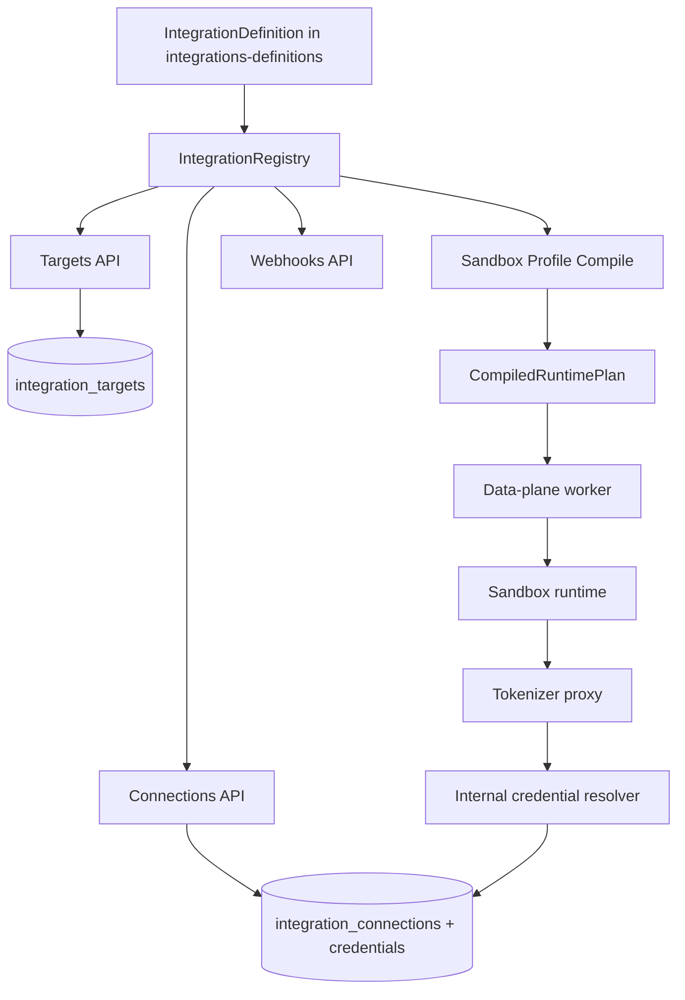

# Integrations API

This README describes Mistle's Integrations API architecture and how to add a new integration.

Terminology note: in product language, people may say "provider". In code and HTTP routes, the system uses "integration" (`/v1/integration/...`). In this document, provider and integration are equivalent.

## What The Integrations API Is

The Integrations API is a definition-driven system for:

1. Describing external providers (OpenAI, GitHub, and others).
2. Validating target, binding, and connection configuration.
3. Compiling provider-specific runtime plans (egress rules, runtime clients, artifacts).
4. Resolving credentials securely at request time.
5. Verifying and normalizing incoming webhook events.

Core route families in control-plane-api:

- `/v1/integration/targets`
- `/v1/integration/connections`
- `/v1/integration/webhooks`

## Packages And Responsibilities

- `@mistle/integrations-core`
- Defines the integration contract (`IntegrationDefinition`), compiler primitives, route matching, runtime-plan validation, webhook and trigger helpers.

- `@mistle/integrations-definitions`
- Registers concrete provider definitions (currently OpenAI and GitHub variants).
- Each definition provides schemas and behavior for compile/auth/webhook handling.

- `apps/control-plane-api`
- Hosts public Integrations HTTP endpoints.
- Persists targets, connections, credentials, OAuth sessions, webhook events.
- Uses the registry to validate and execute integration behavior.

- `apps/data-plane-worker`, `apps/sandbox-runtime`, `apps/tokenizer-proxy`
- Execute compiled runtime plans.
- Enforce egress route policy and inject credentials via internal resolver calls.

## Core Domain Model

- `Target`
- Environment-level integration endpoint/config (`familyId`, `variantId`, enabled, config, encrypted target secrets).

- `Connection`
- Organization-level authenticated relationship to a target (`status`, auth config, encrypted connection secrets, linked credentials).

- `Binding`
- Sandbox profile version attachment that says how a connection is used (`kind`, binding config).

- `CompiledRuntimePlan`
- Deterministic result of compiling bindings, used by runtime (egress routes, artifacts, runtime clients).

## Integration Kinds

`IntegrationKind` supports:

- `agent`
- `git`
- `connector`

Kinds are used on bindings and definitions to enforce compatibility (`binding.kind` must match `definition.kind`).

## IntegrationDefinition

`IntegrationDefinition` is the heart of the system. A provider integration is a single object with schemas + behavior.

Key fields and what they drive:

| Field | Purpose | Where it is used |
| --- | --- | --- |
| `familyId`, `variantId` | Global identity of a provider variant | Registry lookup, target records |
| `kind` | Integration kind (`agent` / `git` / `connector`) | Binding validation during compile |
| `displayName`, `description`, `logoKey` | UI metadata | Target discovery responses |
| `targetConfigSchema` | Parse/validate target config | target list/use, OAuth, compile, webhooks |
| `targetSecretSchema` | Parse/validate decrypted target secrets | OAuth, compile, webhooks |
| `bindingConfigSchema` | Parse/validate per-binding config | Runtime plan compile |
| `supportedAuthSchemes` | Declares allowed auth methods | Connection creation and OAuth gating |
| `credentialResolvers` (optional) | Dynamic credential generation/lookup | Internal credential resolution endpoint |
| `authHandlers.oauth` (optional) | OAuth start/complete behavior | OAuth connection flows |
| `webhookHandler` (optional) | Verify + parse inbound webhooks | Webhook ingest |
| `userConfigSlots` | User-configurable runtime setup slots | Runtime/client customization contract |
| `userSecretSlots` (optional) | User-supplied connection secret slots | Connection create/complete validation |
| `compileBinding(...)` | Generate egress/artifacts/runtime clients | Runtime plan compiler |

## Lifecycle End-To-End



### 1) Target discovery and metadata

- Targets are persisted in control-plane DB.
- Discovery resolves metadata from definitions (`displayName`, `description`) with optional DB overrides.

### 2) Connection creation

- API key flow: validates target + auth support + user secret slots; stores encrypted credentials and connection config.
- OAuth flow: uses `authHandlers.oauth.start` and `authHandlers.oauth.complete`; stores connection config and any returned credential materials.

### 3) Binding to sandbox profile version

- Bindings reference `connectionId`, `kind`, and provider-specific binding config.
- On compile, schemas are parsed and validated through the definition.

### 4) Runtime plan compilation

- `compileBinding(...)` from each definition emits:
- `egressRoutes` (match/upstream/auth injection/credential resolver)
- `artifacts` (install/update/remove runtime tools)
- `runtimeClients` (files/env/processes/endpoints)

- `integrations-core` validates cross-binding conflicts and assembles a deterministic `CompiledRuntimePlan`.

### 5) Runtime execution and egress

- Compiled plan is passed through workflow to data-plane and sandbox runtime.
- Sandbox runtime forwards egress requests with route metadata headers.
- Tokenizer proxy resolves credentials from control-plane internal resolver and injects auth to upstream requests.

### 6) Webhooks

- Webhook ingest resolves definition webhook handler.
- Handler parses event + verifies signature (with target and connection secrets).
- Normalized event is persisted and handed to workflow processing.

## Built-In Integrations

Current registry includes:

- `openai::openai-default` (`kind: agent`)
- `github::github-cloud` (`kind: git`)
- `github::github-enterprise-server` (`kind: git`)

## Creating A New Integration

This is the recommended workflow.

1. Choose identity and kind.
- Decide `familyId`, `variantId`, and `kind`.
- Keep `familyId` stable across variants.

2. Add a definition folder in `packages/integrations-definitions`.
- Follow existing provider structure (`openai/variants/...`, `github/variants/...`).

3. Define schemas.
- `target-config-schema.ts`
- `target-secret-schema.ts` (if needed)
- `binding-config-schema.ts`
- Keep schemas strict and normalized (for example URL normalization).

4. Define auth behavior.
- Set `supportedAuthSchemes`.
- If OAuth is needed, implement `authHandlers.oauth.start/complete`.
- If credential material is dynamic, implement `credentialResolvers`.

5. Define user slots.
- `userConfigSlots` for runtime file/env customization.
- `userSecretSlots` for connection secrets (for example webhook secrets).

6. Implement `compileBinding`.
- Emit minimal scoped egress routes.
- Set correct `credentialResolver` secret type/purpose/resolver key.
- Add runtime artifacts and runtime clients only when required.

7. Add webhook support if provider emits events.
- Implement `webhookHandler.verify` and `webhookHandler.parse`.
- Ensure `connectionRef` can be resolved deterministically.

8. Register the definition.
- Export from provider index and root `packages/integrations-definitions/src/index.ts`.

9. Make the target available.
- Add to seed logic (`apps/control-plane-api/src/integration-targets/services/seed-default-targets.ts`) if it should exist by default.
- Otherwise create target rows through your environment provisioning process.

10. Add tests.
- Schema tests for target/binding/secret parsing.
- Compile tests for egress/artifacts/runtime clients.
- OAuth/webhook handler tests (if implemented).
- Control-plane integration tests for connection and compile flows.

## Design Principles

- Definition-first: behavior comes from `IntegrationDefinition`.
- Fail fast: invalid schema/auth/route/config states error early.
- Least privilege egress: routes should be narrowly scoped by host/path/method.
- Deterministic compile: same inputs produce same runtime plan.
- Secure credential handling: encrypted at rest, resolved only when needed.

## Working Locally

Recommended workspace-level checks:

```bash
pnpm build
pnpm test
```

When running package tests in isolation, build dependencies first if needed:

```bash
pnpm --filter @mistle/integrations-core build
pnpm --filter @mistle/integrations-definitions test
```

## Source Map

Useful entrypoints when reading the code:

- `packages/integrations-core/src/types/index.ts`
- `packages/integrations-core/src/compiler/index.ts`
- `packages/integrations-core/src/validation/index.ts`
- `packages/integrations-core/src/webhooks/index.ts`
- `packages/integrations-definitions/src/index.ts`
- `apps/control-plane-api/src/integration-targets/*`
- `apps/control-plane-api/src/integration-connections/*`
- `apps/control-plane-api/src/integration-webhooks/*`
- `apps/control-plane-api/src/internal-integration-credentials/*`
- `apps/control-plane-api/src/sandbox-profiles/services/compile-profile-version-runtime-plan.ts`
- `apps/sandbox-runtime/internal/egress/*`
- `apps/tokenizer-proxy/src/egress/*`
