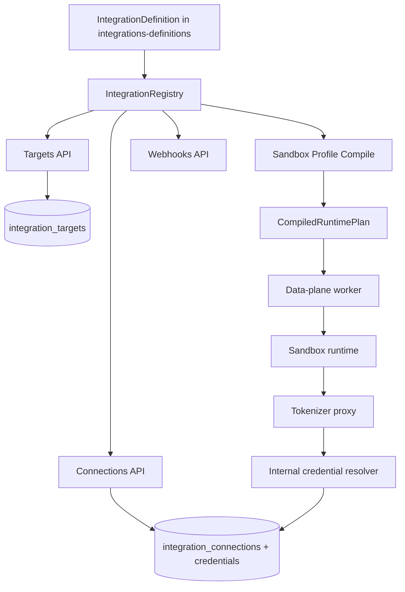

# Integrations API

This README describes Mistle's Integrations API architecture and how to add a new integration.

Terminology note: in product language, people may say "provider". In code and HTTP routes, the system uses "integration" (`/v1/integration/...`). In this document, provider and integration are equivalent.

## What The Integrations API Is

The Integrations API is a definition-driven system for:

1. Describing external providers (OpenAI, GitHub, and others).
2. Validating target, binding, and connection configuration.
3. Compiling provider-specific runtime plans (egress rules, runtime clients, artifacts).
4. Resolving credentials securely at request time.
5. Verifying and normalizing incoming webhook events.

Core route families in control-plane-api:

- `/v1/integration/targets`
- `/v1/integration/connections`
- `/v1/integration/webhooks`

## Personas And Ownership

Two personas interact with this system:

- `operator`
- Deploys/manages a Mistle environment.
- Chooses which provider variants are available in that environment.
- Manages provider target records (`provider_targets` conceptually, implemented as `integration_targets` in the current codebase), including enabled state, environment config, and target secrets.

- `user`
- Uses a deployed Mistle instance inside an organization.
- Can only create connections against enabled operator-managed targets.
- Can bind those connections into sandbox profile versions.

Practical consequence: provider targets are the capability boundary. Users cannot integrate arbitrary providers directly; they integrate only what the operator has exposed through target management.

## Packages And Responsibilities

- `@mistle/integrations-core`
- Defines the integration contract (`IntegrationDefinition`), compiler primitives, route matching, runtime-plan validation, webhook and trigger helpers.

- `@mistle/integrations-definitions`
- Registers concrete provider definitions (currently OpenAI and GitHub variants).
- Each definition provides schemas and behavior for compile/auth/webhook handling.
- Owns provider default target catalog construction (`buildDefaultSeedIntegrationTargets`) and shared browser-safe form registries consumed by dashboard.

- `apps/control-plane-api`
- Hosts public Integrations HTTP endpoints.
- Persists targets, connections, credentials, OAuth sessions, webhook events.
- Uses the registry to validate and execute integration behavior.

- `apps/data-plane-worker`, `apps/sandbox-runtime`, `apps/tokenizer-proxy`
- Execute compiled runtime plans.
- Enforce egress route policy and inject credentials via internal resolver calls.

## Core Domain Model

- `Target`
- Operator-managed provider target (`provider_targets` concept, stored as `integration_targets`): environment-level integration endpoint/config (`familyId`, `variantId`, enabled, config, encrypted target secrets). This defines what users are allowed to connect/bind.

- `Connection`
- Organization-level authenticated relationship to a target (`status`, auth config, encrypted connection secrets, linked credentials).

- `Binding`
- Sandbox profile version attachment that says how a connection is used (`kind`, binding config).

- `CompiledRuntimePlan`
- Deterministic result of compiling bindings, used by runtime (egress routes, artifacts, runtime clients).

## Integration Kinds

`IntegrationKind` supports:

- `agent`
- `git`
- `connector`

Kinds are used on bindings and definitions to enforce compatibility (`binding.kind` must match `definition.kind`).

## IntegrationDefinition

`IntegrationDefinition` is the heart of the system. A provider integration is a single object with schemas + behavior.

Key fields and what they drive:

| Field                                   | Purpose                                                           | Where it is used                          |
| --------------------------------------- | ----------------------------------------------------------------- | ----------------------------------------- |
| `familyId`, `variantId`                 | Global identity of a provider variant                             | Registry lookup, target records           |
| `kind`                                  | Integration kind (`agent` / `git` / `connector`)                  | Binding validation during compile         |
| `displayName`, `description`, `logoKey` | UI metadata                                                       | Target discovery responses                |
| `targetConfigSchema`                    | Parse/validate target config                                      | target list/use, OAuth, compile, webhooks |
| `targetConfigForm` (optional)           | Rendering metadata for target config                              | Operator-facing target config forms       |
| `targetSecretSchema`                    | Parse/validate decrypted target secrets                           | OAuth, compile, webhooks                  |
| `targetSecretForm` (optional)           | Rendering metadata for target secrets                             | Operator-facing target secret forms       |
| `bindingConfigSchema`                   | Parse/validate per-binding config                                 | Runtime plan compile                      |
| `bindingConfigForm` (optional)          | Rendering metadata for per-binding config                         | Dashboard binding editor                  |
| `connectionConfigSchema`                | Parse/validate per-connection config                              | Binding write validation, compile         |
| `connectionConfigForm` (optional)       | Rendering metadata for per-connection config                      | Connection-related forms                  |
| `supportedAuthSchemes`                  | Declares allowed auth methods                                     | Connection creation and OAuth gating      |
| `credentialResolvers` (optional)        | Dynamic credential generation/lookup                              | Internal credential resolution endpoint   |
| `authHandlers.oauth` (optional)         | OAuth start/complete behavior                                     | OAuth connection flows                    |
| `webhookHandler` (optional)             | Resolve inbound webhook requests to events or immediate responses | Webhook ingest                            |
| `mcp` (optional)                        | Declare one or more MCP servers for this binding                  | MCP collection during compile             |
| `mcpConfig` (optional)                  | Declarative MCP config target for an agent                        | Post-compile MCP file update              |
| `validateBindingWriteContext(...)`      | Contextual target/connection/binding validation                   | Binding write and compile parity checks   |
| `compileBinding(...)`                   | Generate egress/artifacts/runtime clients                         | Runtime plan compiler                     |

## Lifecycle End-To-End



### 1) Target discovery and metadata

- Targets are operator-managed records persisted in control-plane DB.
- Discovery resolves metadata from definitions (`displayName`, `description`) with optional DB overrides.
- Control-plane target discovery also returns definition-owned capability metadata (`logoKey`, `supportedAuthSchemes`) and config health metadata (`targetHealth`).
- UI consumers may use raw target and connection config together with definition-owned schema/form metadata to resolve form rendering client-side.
- `@mistle/integrations-core` owns the renderer-agnostic schema/form contract and generic form resolution helpers.
- For browser clients, definitions expose browser-safe integration registries through `@mistle/integrations-definitions/forms` so dashboard code does not duplicate provider-specific wiring.

### 2) Connection creation

- API key flow: validates target + auth support; stores encrypted credentials and connection config.
- OAuth flow: uses `authHandlers.oauth.start` and `authHandlers.oauth.complete`; stores connection config and any returned credential materials.

### 3) Binding to sandbox profile version

- Bindings reference `connectionId`, `kind`, and provider-specific binding config.
- This is user-scoped usage of operator-managed capabilities (targets) through org-owned connections.
- Validation now runs in two phases through shared definition logic:
- Write-time: on binding `PUT`, control-plane parses target/connection/binding config through definition schemas and runs `validateBindingWriteContext(...)` when provided.
- Compile-time: before `compileBinding(...)`, compiler runs the same definition-level binding write validation contract to keep parity with write-time checks.
- Contextual validation covers cross-object semantics (for example auth scheme compatibility with model/reasoning) beyond schema shape parsing.
- Validation issues are surfaced as stable machine codes plus safe messages for UI/API consumers.

### 4) Runtime plan compilation

- `compileBinding(...)` from each definition emits:
- `egressRoutes` (match/upstream/auth injection/credential resolver)
- `artifacts` (install/update/remove runtime tools)
- `runtimeClients` (files/env/processes/endpoints)

- `integrations-core` then runs an MCP pass across the whole sandbox profile version:
- connector, git, or agent bindings may expose MCP servers through `mcp`
- egress URL refs inside MCP definitions are resolved to concrete sandbox egress URLs
- agent bindings with `mcpConfig` have the configured file path updated in-place (`toml` or `json`) before runtime-plan assembly

- `integrations-core` validates cross-binding conflicts and assembles a deterministic `CompiledRuntimePlan`.

### 5) Runtime execution and egress

- Compiled plan is passed through workflow to data-plane and sandbox runtime.
- Sandbox runtime forwards egress requests with route metadata headers.
- Tokenizer proxy resolves credentials from control-plane internal resolver and injects auth to upstream requests.

### 6) Webhooks

- Webhook ingest resolves definition webhook handler.
- Handler first resolves the inbound request into either an immediate HTTP response or a normalized event.
- Immediate HTTP response: returned directly and bypasses connection resolution, persistence, and workflow processing.
- Normalized event: continues through connection resolution and verification (with target and connection secrets), then is persisted and handed to workflow processing.

## Built-In Integrations

Current registry includes:

- `openai::openai-default` (`kind: agent`)
- `atlassian::atlassian-default` (`kind: connector`)
- `github::github-cloud` (`kind: git`)
- `github::github-enterprise-server` (`kind: git`)
- `linear::linear-default` (`kind: connector`)

## Creating A New Integration

This is the recommended workflow.

1. Choose identity and kind.

- Decide `familyId`, `variantId`, and `kind`.
- Keep `familyId` stable across variants.

2. Add a definition folder in `packages/integrations-definitions`.

- Follow existing provider structure (`openai/variants/...`, `github/variants/...`).

3. Define schemas.

- `target-config-schema.ts`
- `target-secret-schema.ts` (if needed)
- `binding-config-schema.ts`
- `connection-config-schema.ts` (if connection config has integration-specific shape)
- `target-config-form.ts` / `target-secret-form.ts` / `binding-config-form.ts` / `connection-config-form.ts` (optional): provider-owned rendering metadata for the corresponding schema.
- Keep schemas strict and normalized (for example URL normalization).
- If binding semantics depend on cross-object context (target + connection + binding), implement `validateBindingWriteContext(...)` in the definition.
- Keep schema fields as the source of truth for shape and validation. Form fields should only describe rendering behavior (widgets, ordering, labels, context-aware choice narrowing).

4. Define auth behavior.

- Set `supportedAuthSchemes`.
- If OAuth is needed, implement `authHandlers.oauth.start/complete`.
- If credential material is dynamic, implement `credentialResolvers`.

5. Define target secrets.

- Put operator-managed provider secrets in `targetSecretSchema` (for example webhook signing secrets and app private keys).

6. Implement `compileBinding`.

- Emit minimal scoped egress routes.
- Set correct `credentialResolver` secret type/purpose/resolver key.
- Add runtime artifacts and runtime clients only when required.
- If the integration exposes its own MCP endpoint, define `mcp` with either a single server or an array of servers.
- Prefer canonical upstream MCP URLs in definitions. Route-shaped sandbox URLs are runtime transport details, not definition-authored config.

7. If this is an agent integration and MCP should be auto-configured, define `mcpConfig`.

- `mcpConfig` is declarative:
- `clientId`
- `fileId`
- `format` (`toml` or `json`)
- `path` (for example `["mcp_servers"]` for Codex TOML or `["mcpServers"]` for JSON-based agents)
- The core compiler owns parsing, replacing that path, and serializing the file content.

8. Add webhook support if provider emits events.

- Implement `webhookHandler.resolveWebhookRequest`, `webhookHandler.resolveConnection`, and `webhookHandler.verify`.
- `resolveWebhookRequest` should return either an immediate response or a normalized event.
- `{ kind: "response", response }`: for protocol-level requests that must be answered immediately.
- `{ kind: "event", event }`: for requests that should continue through the durable ingest path.
- Keep connection resolution explicit and deterministic from the normalized event payload + candidate connections.

9. Register the definition.

- Export from provider index and root `packages/integrations-definitions/src/index.ts`.

10. Make the target available.

- Register the definition in `packages/integrations-definitions/src/index.ts`.
- Control-plane target sync scripts will insert/update the `integration_targets` row from registry definitions.
- Provide operator-owned config/secrets through `integration-targets.provision.json`.

11. Add tests.

- Schema tests for target/binding/secret parsing.
- Compile tests for egress/artifacts/runtime clients.
- MCP compile tests when applicable:
- producer tests for declared MCP server shape
- compiler tests for MCP ref resolution and duplicate detection
- agent tests for TOML/JSON file updates when `mcpConfig` is present
- OAuth/webhook handler tests (if implemented).
- Control-plane integration tests for connection and compile flows.
- Form resolution tests: ensure schema-backed form helpers produce the expected resolved JSON Schema and UI metadata.
- Context-aware form tests: ensure target/connection/current-value context narrows or specializes rendering as intended.
- Generic form helper tests belong in `@mistle/integrations-core`; provider-specific context-aware form tests should live next to the `*-form.ts` module.

## Design Principles

- Definition-first: behavior comes from `IntegrationDefinition`.
- Fail fast: invalid schema/auth/route/config states error early.
- Least privilege egress: routes should be narrowly scoped by host/path/method.
- Deterministic compile: same inputs produce same runtime plan.
- Secure credential handling: encrypted at rest, resolved only when needed.

## Working Locally

Recommended workspace-level checks:

```bash
pnpm build
pnpm test
```

When running package tests in isolation, build dependencies first if needed:

```bash
pnpm --filter @mistle/integrations-core build
pnpm --filter @mistle/integrations-definitions test
```

## Source Map

Useful entrypoints when reading the code:

- `packages/integrations-core/src/types/index.ts`
- `packages/integrations-core/src/compiler/index.ts`
- `packages/integrations-core/src/mcp-config/index.ts`
- `packages/integrations-core/src/egress-url/index.ts`
- `packages/integrations-core/src/validation/index.ts`
- `packages/integrations-core/src/binding-validation/index.ts`
- `packages/integrations-core/src/webhooks/index.ts`
- `packages/integrations-core/src/forms/*`
- `packages/integrations-definitions/src/index.ts`
- `packages/integrations-definitions/src/forms/*`
- `apps/control-plane-api/src/integration-targets/*`
- `apps/control-plane-api/src/integration-connections/*`
- `apps/control-plane-api/src/integration-webhooks/*`
- `apps/control-plane-api/src/internal-integration-credentials/*`
- `apps/control-plane-api/src/sandbox-profiles/services/compile-profile-version-runtime-plan.ts`
- `apps/sandbox-runtime/internal/egress/*`
- `apps/tokenizer-proxy/src/egress/*`
